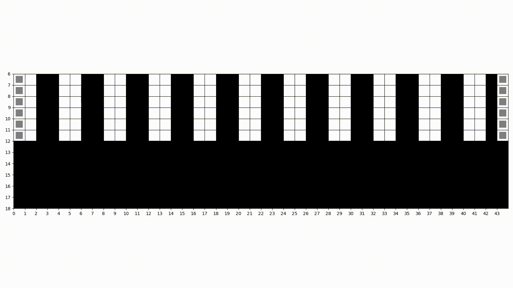

# Cellular Automata - Pedestrian conflicts with vehicles

## Introduction

This is a Python implementation of the cellular automata model described
in the paper [Li, Xiaomeng & li, Xingang & Wang, Jiangfeng. (2012). Using Cellular Automata to Investigate Pedestrian Conflicts
with Vehicles in Crosswalk at Signalized Intersection. Discrete Dynamics in Nature and Society. 2012.
10.1155/2012/287502.](https://www.hindawi.com/journals/ddns/2012/287502/)

Two scenarios have been implemented:
- Scenario 1
  - 50 seconds of pedestrian green light
  - 6 meters of crosswalk width
- Scenario 2
  - 35 seconds of pedestrian green light
  - 5 meters of crosswalk width

More scenarios can be implemented by setting the environment
variables used in the [config.py](src/config.py) and [run_scenario.py](src/run_scenario.py) files.

Aditionally, an animation of one of the scenarios can be run.



## Requirements

- Python 3.11 or higher
- Make

## Usage

### Install dependencies

```bash
make install_dependencies
```

### Run scenario 1

```bash
make scenario_1
```

### Run scenario 2

```bash
make scenario_2
```

### Run animation

```bash
make animation
```

## Using the results

The results of the simulation are saved in the `results` directory. They are saved in a CSV format with the following columns:
- `pedestrian_arrival_rate`: The pedestrian arrival rate, measured in pedestrians per hour.
- `vehicle_arrival_rate`: The vehicle arrival rate, measured in vehicles per hour.
- `conflicts`: The number of conflicts between pedestrians and vehicles during the simulation of the scenario.